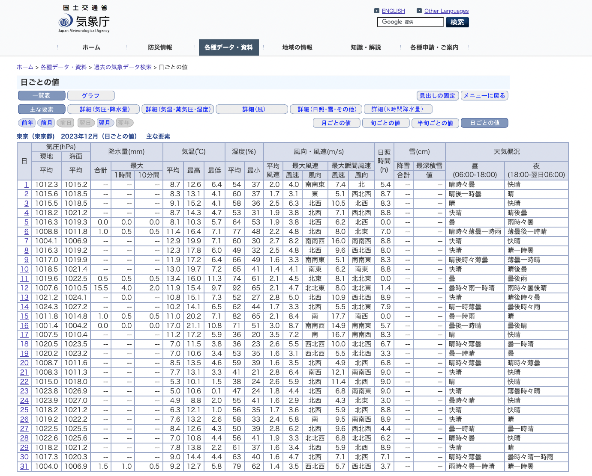

# scraping_weather

気象庁の以下のような日毎のサイトからスクレイピングし、2016年〜最新のデータを時系列データフレームに格納するモジュールです。<br>
月毎のウェブサイトをスクレイピングしていくので、実行完了に3-5分くらいかかってしまうのはご注意ください...
<br>
↓スクレイピングするサイトページの1例<br>
https://www.data.jma.go.jp/stats/etrn/view/daily_s1.php?prec_no=44&block_no=47662&year=2023&month=12&day=1&view=
<br>
<br>


## モジュールの使い方

使用イメージとしては、run.pyのコードを参照ください。

### STEP1：モジュールのインポート
モジュールを任意のdirectoryに格納し、importしてください。<br>
(今回は、scriptと同じ階層にモジュールであるscraping_jma.pyがあることを想定)

```
import importlib
import scraping_jma
from scraping_jma import scraping_jma_daily_data_from_2016_to_latest
importlib.reload(scraping_jma)
```

また、以下モジュールを活用しているので、必要あればpip installしてください
- pandas
- beautifulsoup4
- requests

### STEP2

引数として、2つを指定する必要がある。

- PREC_NO：地域ごとに振り分けられた番号
- BLOCK_NO：地点ごとに振り分けられた番号

↓ PREC_NOとBLOCK_NOの番号の対応は以下を参照してみてください。<br>
http://k-ichikawa.blog.enjoy.jp/etc/HP/htm/jmaP0.html

それを引数として与えて、scraping_jma_daily_data_from_2016_to_latest関数を実行すればpandas dataframe形式で返してくれます！
```
data_jma = scraping_jma_daily_data_from_2016_to_latest(PREC_NO, BLOCK_NO)
```


